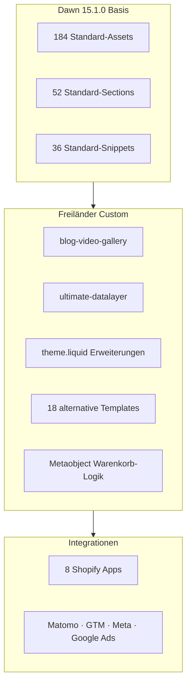
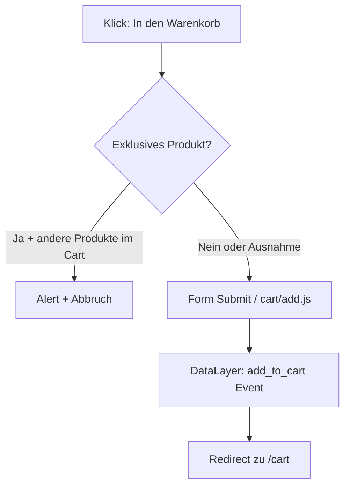

# Freiländer Shopify Theme

Shopify-Theme für den **Freiländer Bio Geflügel Online-Shop** — basierend auf [Dawn 15.1.0](https://github.com/Shopify/dawn), erweitert um umfangreiche Custom-Entwicklungen für saisonale Bio-Produkte, Logistik-Regeln und E-Commerce-Tracking.

**Shop:** [shop.freilaender.de](https://shop.freilaender.de)  
**Repository:** [github.com/yahyajohnny/shopify-theme-freilaender](https://github.com/yahyajohnny/shopify-theme-freilaender)

---

## Inhaltsverzeichnis

- [Überblick](#überblick)
- [Theme-Architektur](#theme-architektur)
- [Custom-Entwicklungen](#custom-entwicklungen)
- [Alternative Templates](#alternative-templates)
- [Shopify Apps](#shopify-apps)
- [Analytics & Tracking](#analytics--tracking)
- [Metafields & Metaobjects](#metafields--metaobjects)
- [Design & Branding](#design--branding)
- [Lokalisierung](#lokalisierung)
- [Projektstruktur](#projektstruktur)
- [Entwicklung](#entwicklung)

---

## Überblick

| Eigenschaft | Wert |
|---|---|
| Basis-Theme | Dawn **15.1.0** (Shopify) |
| Sprache | Deutsch (DE / CH) |
| Warenkorb-Typ | Seite (`cart_type: page`) |
| Seitenbreite | 1600px |
| Schriftarten | Ubuntu (Überschriften), Assistant (Fließtext) |
| Dateien gesamt | ~372 Theme-Dateien |

Das Theme ist im Kern ein Standard-Dawn-Theme. Die eigentliche Geschäftslogik steckt in **Custom Sections**, **JSON-Template-Alternativen**, **inline Liquid/CSS/JS** und einer stark erweiterten `layout/theme.liquid`.

---

## Theme-Architektur



---

## Custom-Entwicklungen

### 1. Blog Video & Galerie

**Datei:** `sections/blog-video-gallery.liquid`  
**Verwendet in:** `templates/article.json`

Vollständig custom gebaute Section für Rezept-Artikel:

- **Zweispaltiges Layout:** YouTube-Video links, Bildergalerie (2×2) rechts
- **Metafields am Artikel:**
  - `custom.youtube_video_link` — YouTube-Embed
  - `custom.fotos_fuer_bildergalerie` — Bildliste für Galerie
- **Lightbox** mit Vor/Zurück-Navigation, Escape-Taste, responsive Breakpoints
- CSS und JavaScript direkt in der Section (kein separates Asset)

---

### 2. Ultimate Shopify DataLayer

**Datei:** `snippets/ultimate-datalayer.liquid` (v3.6.1, Leo Measure)  
**Eingebunden in:** `layout/theme.liquid`

GA4-kompatibles E-Commerce-Tracking über `window.dataLayer`:

| Event | Beschreibung |
|---|---|
| `leomeasure_view_item` | Produktansicht |
| `leomeasure_add_to_cart` | In den Warenkorb |
| `leomeasure_remove_from_cart` | Aus Warenkorb entfernen |
| `leomeasure_view_cart` | Warenkorb ansehen |
| `leomeasure_begin_checkout` | Checkout starten |
| `leomeasure_search` | Suche |
| `leomeasure_add_to_wishlist` | Merkliste |

**Besonderheiten:**
- Interceptiert `fetch` und `XMLHttpRequest` für `/cart/add`, `/cart/change` und Suche
- `isAddToCartRedirect: true` — leitet nach Add-to-Cart auf `/cart` um
- Pusht Kundendaten (inkl. SHA256-Hash) ins DataLayer

---

### 3. Exklusive-Produkte-Warenkorb-Logik

**Datei:** `layout/theme.liquid` (Zeilen ~450–615)

Verhindert per JavaScript das Mischen bestimmter Festtagsprodukte mit normalen Artikeln:



- Liest Shopify-**Metaobjects** `exklusive_produkte` und `ausname_produkte`
- Deutsche Alert-Meldungen bei Regelverletzung
- Interceptiert Form-Submit und `/cart/add.js`-Fetch

---

### 4. Liefertermin-Rechner

**Verwendet in:** Produkt-Templates (`product.weihnachts*.json`, `product.bio-lammfleisch.json` …)

Dynamischer Liefertermin-Rechner als `custom_liquid`-Block:

- Konfigurierbare `deliverySlots` (Bestellfrist → Lieferdatum)
- Zeigt z. B. „Aktueller Liefertermin: 13.05.2025“
- Grüner Info-Banner (`#2d6c2b`) für Sammellieferungen (Bio-Lammfleisch)

---

### 5. Produkt-Tab-Navigation

**Verwendet in:** Weihnachts- und Bio-Produkt-Templates

Tab-UI mit Metafield-Inhalten:

| Tab | Metafield |
|---|---|
| Zutaten | `custom.zutaten` |
| Bestandteile | `custom.bestandteile_details` |
| FAQ | `custom.faq` |
| Gut zu wissen | `custom.gut_zu_wissen_` |
| Nährwerte | `custom.naehrwerte` |
| Verpackung | `custom.verpackung` |
| Zubereitung | `custom.pute_vorbereiten` / `custom.pute_zerlegen` |

Zusätzlich: Inline-Zahlungsmethoden-SVGs und Custom Accordion-Styling (`#0f2b0e`).

---

### 6. Barrierefreiheits-Widget

**Datei:** `layout/theme.liquid` (inline, ab Zeile ~617)

Eingebettetes Accessibility-Menü mit deutschen Übersetzungen:

- Schriftgröße anpassen
- Kontrast erhöhen
- Dyslexie-Schrift
- Animationen reduzieren

> **Hinweis:** Parallel ist die **SEA Accessibility App** eingebunden — potenziell doppelte Barrierefreiheits-Tools.

---

### 7. Weitere Code-Anpassungen

| Datei | Anpassung |
|---|---|
| `layout/theme.liquid` | Analytics (Matomo, GTM, Meta Pixel, Google Ads), Warenkorb-Logik, A11y-Widget |
| `sections/footer.liquid` | Zusätzliche Links: „Vertrag widerrufen“, „Barrierefreiheit“ |
| `sections/main-cart-footer.liquid` | `#fsb_placeholder` für Versand-App; Ausnahme für Weihnachtsprodukte |
| `sections/footer-group.json` | Freiländer-Logo, Kontaktdaten, Social-Icons, Custom CSS |
| `sections/header-group.json` | Announcement-Bar, Menü-Schriftgröße (16px bold) |
| `assets/base.css` | Custom CSS: Banner-Rough-Edge-Mask, Header-Styles |

---

## Alternative Templates

### Produkt-Templates

| Template | Zweck |
|---|---|
| `product.weihnachtspute.json` | Weihnachtspute mit Liefertermin, Tabs, Order-Bump |
| `product.weihnachtsgans.json` | Weihnachtsgans — gleiche Struktur |
| `product.weihnachtsente.json` | Weihnachtsente — gleiche Struktur |
| `product.bio-lammfleisch.json` | Bio-Lamm mit Sammelliefer-Banner |
| `product.bio-freiland-pute.json` | Standard-Pute mit Tabs und Zahlungsicons |
| `product.normale-freiland-pute.json` | Cross-Sell-Banner zur Weihnachtspute |
| `product.gift-card-pro.liquid` | Redirect zu Gift Card Pro App (`/a/gc/gift-card/`) |

### Collection-Templates

| Template | Zweck |
|---|---|
| `collection.grillfleisch.json` | Bio-Grillfleisch-Kollektion |
| `collection.weihnachtsgefluegel.json` | Weihnachtsgeflügel mit Cross-Sell |
| `collection.einzelprodukte-pakete.json` | Metafield-gesteuerte Featured Collections |

### Seiten-Templates (Kampagnen & Content)

| Template | Zweck |
|---|---|
| `page.bio-lammfleisch.json` | Landingpage Bio-Lammfleisch |
| `page.schaffelle.json` | Schaffelle-Landing (Verfügbarkeit Frühjahr 2026) |
| `page.oktoberfest.json` | Wiesn-Kampagne |
| `page.nfl-party.json` | NFL Game Day mit Rezept-Link |
| `page.haeufig-gestellte-fragen.json` | Umfangreiche FAQ + Kontaktformular |
| `page.vertrag-widerrufen.json` | Widerrufsformular (Shopify Forms) |
| `page.hulkapp_ost_page.liquid` | Container für Hulk App-Inhalt |
| `page.contact.json` | Kontaktseite |

### Weitere angepasste Templates

| Template | Anpassung |
|---|---|
| `templates/article.json` | Rezept-Layout mit `blog-video-gallery`, Metafields für Zutaten/Zubereitung |
| `templates/cart.json` | Banner bei Tag `Bio-Lammfleisch` im Warenkorb |
| `templates/index.json` | Saisonaler Grill-Hero, DLG-Auszeichnung, Custom Banner-CSS |

---

## Shopify Apps

Folgende Apps sind als Embeds oder Template-Blocks eingebunden (`config/settings_data.json`):

| App | Zweck |
|---|---|
| **Gift Card Pro** | Geschenkgutschein-Shop |
| **Bsure Checkout Rules** | Checkout-Regeln |
| **EcomSend Popups** | Popup-Marketing |
| **Addon Checkbox Order Bump** | Upsell-Checkboxen im Warenkorb/auf Produktseiten |
| **Shopify Inbox** | Live-Chat |
| **SEA Accessibility** | Barrierefreiheits-App |
| **Bird Pickup & Delivery** | Abholung/Lieferung (CH-Markt) |
| **Shopify Subscriptions** | Abo-Widget auf Produktseiten |

---

## Analytics & Tracking

| Dienst | Ort | ID / URL |
|---|---|---|
| **Matomo** | `layout/theme.liquid` | Site 237, `matomo.kasperdev.de` |
| **Google Tag Manager** | `layout/theme.liquid` | `GTM-K3C9RB26` |
| **Google Ads** | `layout/theme.liquid` | `AW-781526930` |
| **Meta Pixel** | `layout/theme.liquid` | `426122685055238` |
| **Ultimate DataLayer** | `snippets/ultimate-datalayer.liquid` | Leo Measure GA4-Events |

---

## Metafields & Metaobjects

### Artikel-Metafields (Rezepte)

| Namespace | Key | Verwendung |
|---|---|---|
| `custom` | `youtube_video_link` | YouTube-Video in `blog-video-gallery` |
| `custom` | `fotos_fuer_bildergalerie` | Bildergalerie in `blog-video-gallery` |
| `custom` | `zutaten`, `naehrwerte`, `faq` … | Produkt-Tab-Inhalte |

### Collection-Metafields

| Namespace | Key | Verwendung |
|---|---|---|
| `custom` | `paket_kategorie` | Featured Collection in `collection.einzelprodukte-pakete` |
| `custom` | `einzelprodukt_kategorie` | Featured Collection in `collection.einzelprodukte-pakete` |

### Metaobjects (Shopify Admin)

| Typ | Zweck |
|---|---|
| `exklusive_produkte` | Produkte mit isoliertem Warenkorb (Festtagsprodukte) |
| `ausname_produkte` | Ausnahmen, die mit exklusiven Produkten kombiniert werden dürfen |

---

## Design & Branding

### Farbschemata (Freiländer CI)

| Scheme | Hintergrund | Button | Verwendung |
|---|---|---|---|
| `scheme-1` | `#ffffff` | `#b68c37` (Gold) | Standard |
| `scheme-2` | `#2d6c2b` (Bio-Grün) | `#ffffff` | Banner, Kampagnen |
| `scheme-6f7b96b8…` | `#0f2b0e` (Dunkelgrün) | `#b68c37` | Produktkarten, Accordions |
| `scheme-503c7395…` | `#b68c37` | `#2d6c2b` | Announcement-Bar |

### Design-Merkmale

- Eckige Buttons (`buttons_radius: 0`)
- Hover-Animation: `vertical-lift`
- Custom Banner-Rough-Edge via SVG-Mask in `base.css`
- Logo-Animation beim Scrollen (Header)

---

## Lokalisierung

| Datei | Zweck |
|---|---|
| `locales/de.json` | Theme-Strings + Checkout-Overrides (Telefon, Adressfelder) |
| `locales/de-DE.json` | Deutschland: Versand, Tracking, Lieferstatus |
| `locales/de-CH.json` | Schweiz: Abholung statt Versand, Pickup-Formulierung |

Alle übrigen ~50 Locale-Dateien sind Dawn-Standard.

---

## Projektstruktur

```
shopify-theme-freilaender/
├── assets/                  # 184 Dawn-Standard-Assets + Custom CSS in base.css
├── config/
│   ├── settings_data.json   # Theme-Einstellungen, App-Embeds, Farbschemata
│   └── settings_schema.json # Dawn 15.1.0 Schema
├── layout/
│   ├── theme.liquid         # ★ Hauptanpassung: Analytics, Cart-Logik, A11y
│   └── password.liquid
├── locales/                 # de, de-DE, de-CH + Dawn-Standard
├── sections/
│   ├── blog-video-gallery.liquid  # ★ Custom Section
│   ├── footer.liquid              # ★ Angepasst
│   ├── main-cart-footer.liquid    # ★ Angepasst
│   └── … (51 weitere Dawn-Sections)
├── snippets/
│   ├── ultimate-datalayer.liquid  # ★ Custom Snippet
│   └── … (36 weitere Dawn-Snippets)
└── templates/
    ├── product.*.json/liquid      # ★ 7 alternative Produkt-Templates
    ├── collection.*.json          # ★ 3 alternative Collection-Templates
    ├── page.*.json/liquid         # ★ 8 alternative Seiten-Templates
    └── … (Standard-Templates)
```

**Legende:** ★ = Custom oder angepasst

---

## Entwicklung

### Voraussetzungen

- [Shopify CLI](https://shopify.dev/docs/api/shopify-cli)
- Zugang zum Freiländer Shopify-Store

### Lokale Entwicklung

```bash
# Repository klonen
git clone https://github.com/yahyajohnny/shopify-theme-freilaender.git
cd shopify-theme-freilaender

# Theme mit Store verbinden und lokal starten
shopify theme dev --store shop.freilaender.de
```

### Theme deployen

```bash
# Auf Live-Theme pushen
shopify theme push --store shop.freilaender.de

# Nur bestimmte Dateien pushen
shopify theme push --only sections/blog-video-gallery.liquid
```

### Wichtige Hinweise für Entwickler

1. **Keine separaten Custom-Assets** — Custom CSS/JS liegt inline in Sections, Templates und `theme.liquid`
2. **Metaobjects pflegen** — Warenkorb-Regeln werden über Shopify Admin Metaobjects gesteuert, nicht im Theme-Code
3. **Liefertermine aktualisieren** — `deliverySlots` in Produkt-Templates manuell anpassen (JSON-Editor im Theme-Admin)
4. **GTM doppelt eingebunden** — In `theme.liquid` zweimal vorhanden (Zeilen ~328 und ~356); bei Änderungen beide Stellen prüfen
5. **App-Abhängigkeiten** — 8 Apps müssen im Store installiert sein, damit alle Features funktionieren

---

## Custom vs. Dawn — Zusammenfassung

| Kategorie | Dawn-Standard | Freiländer-Custom |
|---|---|---|
| Sections | 52 von 53 | **1 neu** + 2 modifiziert |
| Snippets | 36 von 37 | **1 neu** (`ultimate-datalayer`) |
| Assets | 184 Standard | **0 neue Dateien** (Custom CSS in `base.css`) |
| Templates | 19 Standard | **+18 alternative Templates** |
| `layout/theme.liquid` | Basis | **Stark erweitert** |
| Locales | 54 Standard | **de-CH + de-DE** checkout-spezifisch |

---

## Kontakt

**Freiländer Bio Geflügel GmbH**  
Tel: +49 8133 9962-22  
E-Mail: shop@freilaender.de  
Web: [shop.freilaender.de](https://shop.freilaender.de)
